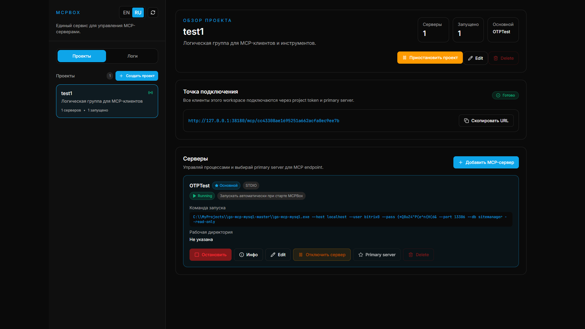

# 📦 MCPBox: Пульт управления вашими ИИ-агентами

**MCPBox** — это центр управления для ваших MCP-серверов, написанный на Go. Он объединяет базы данных, локальные скрипты и API в единую сеть, к которой удобно подключать Claude, Cursor, Codex и другие ИИ-инструменты.

## 🎯 Для чего это нужно?

Когда у вас много MCP-серверов, управлять ими через конфиги становится сложно. MCPBox превращает "хаос из JSON-файлов" в понятную панель управления, где вы полностью контролируете доступ ИИ к вашим данным.

### Основные возможности:
- **Группировка по проектам:** Создавайте отдельные рабочие пространства для разных задач или клиентов.
- **Единая точка входа:** Один URL на весь проект. Меняйте серверы внутри проекта, не меняя настройки в Claude или Cursor.
- **Безопасность и контроль:**
    - **Пауза проекта:** Мгновенно заблокируйте доступ ИИ к данным одной кнопкой.
    - **Журнал аудита:** Видьте каждый запрос и ответ в реальном времени. Никаких скрытых действий от ИИ.
- **Инспекция серверов:** Удобный просмотр всех доступных инструментов (tools) и ресурсов вашего сервера прямо в браузере.
- **Все в одном файле:** Не требует установки базы данных. Просто скачал и запустил.

## ⚡️ Быстрый старт

1. **Запуск:** Скачайте бинарный файл для вашей ОС и запустите его.
2. **Панель управления:** Перейдите по адресу `http://localhost:38180` (откроется автоматически).
3. **Создание проекта:** Добавьте новый проект и подключите к нему нужные серверы (локальные или удаленные).
4. **Подключение ИИ:** Скопируйте уникальную ссылку проекта и вставьте её в настройки вашего ИИ-клиента. Основной MCP path теперь `/mcp/{project_token}`.

## 📚 Дополнительно
- **[English Version](./README.md)** — Основная документация на английском.
- **[Для разработчиков](./DEVELOPER.md)** — Техническое описание API, структура проекта и инструкции по сборке.

---
*Безопасное и быстрое управление MCP-инфраструктурой.*
