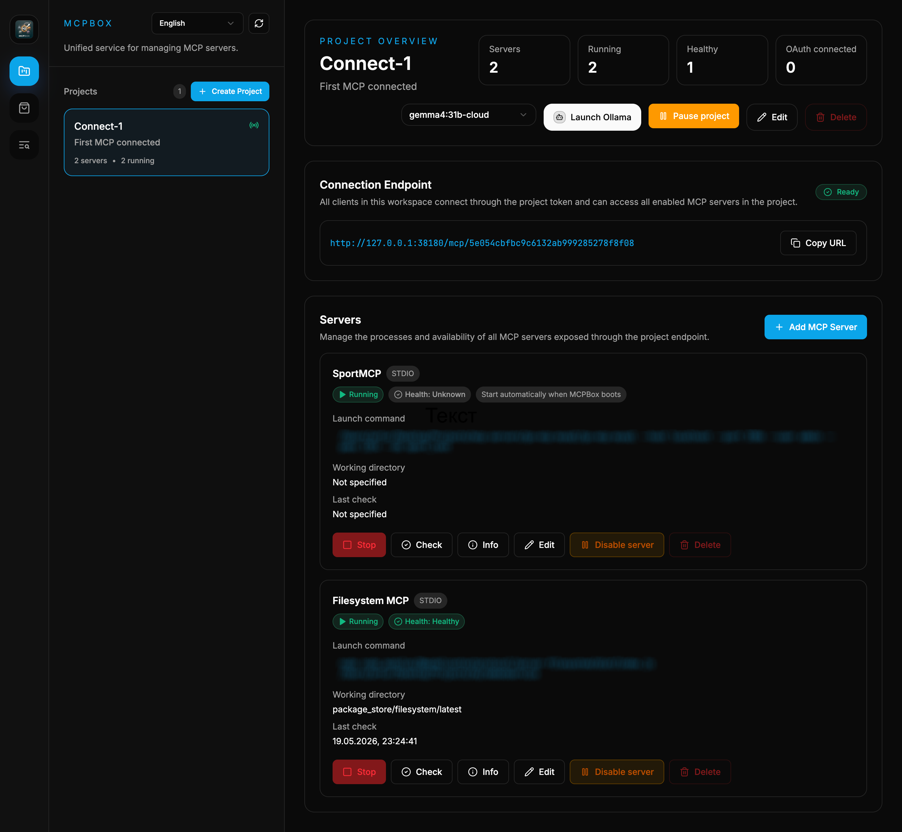
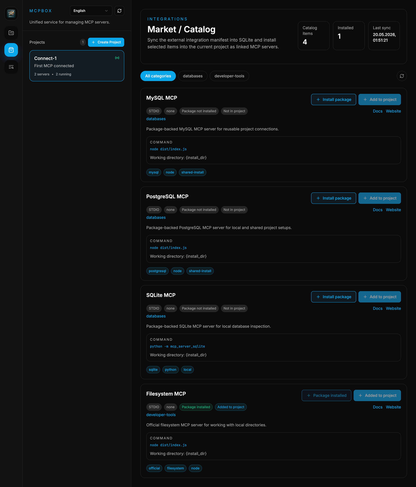
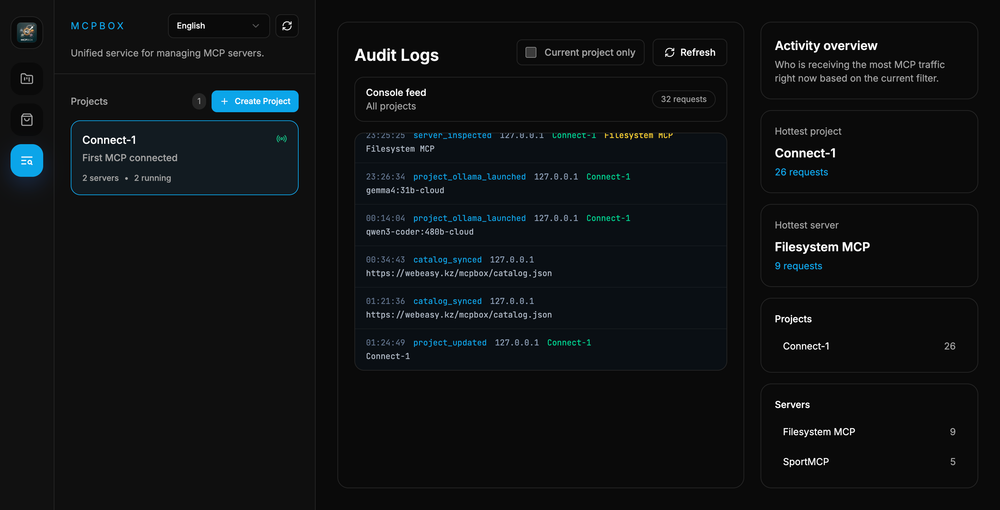

# MCPBox

MCPBox is a Go-based control plane for MCP servers. It lets you group local and remote MCP backends by project, inspect what they expose, monitor traffic, and publish a single project URL for AI clients such as Claude, Cursor, Codex, LM Studio, and local Ollama-based workflows.

<p align="center">
  <a href="images/main.png">
    
  </a>
  <a href="images/market.png">
    
  </a>
  <a href="images/log.png">
    
  </a>
</p>

<p align="center">
  <sub>Click any screenshot to open it in full size.</sub>
</p>

## Why MCPBox

Managing several MCP servers quickly turns into a mix of JSON snippets, terminal tabs, and half-documented local setup. MCPBox gives you one embedded UI and one local binary for the operational side of that work.

Key capabilities:
- Project-based organization for local `stdio` and remote `HTTP streaming` MCP servers
- One project MCP endpoint at `/mcp/{project_token}` that aggregates all enabled servers in the project
- Built-in Knowledge Base / RAG collections with local indexing for code, text, CSV, XLSX, DOCX, PPTX, and text-based PDF
- Live inspection of `tools`, `resources`, `prompts`, and nearby README files for local `stdio` servers
- Health checks on create, update, manual check, and local server start
- Audit log for MCP traffic and control actions
- Project pause/resume and per-server enable/disable controls
- Embedded Market / Catalog flow for syncing, installing, verifying, and uninstalling integrations
- One-click Ollama and llama.cpp launchers for local MCP testing
- Single-binary deployment with embedded React UI and local SQLite storage

## What Is New In 1.2.3

- Project prompts are now exposed both as the existing `get_project_env_and_rules` MCP tool and as a standard MCP prompt named `project_prompt`
- The project MCP endpoint now keeps `prompts/list` working even when an upstream MCP server clearly reports that prompts are not supported
- llama.cpp project launch now writes the project prompt to a temporary system prompt file and starts `llama-server` with `--system-prompt-file`
- Managed llama.cpp servers restart when the selected model or project prompt changes, so prompt edits are applied on the next launch
- Windows build compatibility was fixed for the managed llama.cpp process launcher by moving Unix process-group handling into platform-specific files

## What Is New In 1.2.2

- New `Launch Project` dialog that groups local launch actions in one place instead of exposing only a direct Ollama button
- LM Studio launch support with `Add to LM Studio` flow through a generated `lmstudio://add_mcp` deeplink
- Better Ollama launch UX with model refresh inside the dialog and clearer empty-state handling when Ollama is not installed or has no local models
- Server `Check` action now returns the latest health result immediately so the UI can show success or failure feedback without waiting for a full project reload
- Aggregated project MCP traffic now writes explicit audit events for `tools/list`, `tools/call`, `resources/list`, `resources/read`, `prompts/list`, and `prompts/get`
- Health checks are much deeper for both local `stdio` and remote `HTTP streaming` servers: after `initialize`, MCPBox now verifies list endpoints and can run a safe follow-up probe such as DB query checks or filesystem listing
- Health-check traces now record sanitized diagnostic details in the audit log, while masking secrets in command arguments, headers, URLs, and JSON payloads
- Catalog install flow now supports `install.strategy: "go_install"` for Go-based integrations and maps managed binaries back into the generated server command
- Registry cleanup on stop is safer: stopped server runners are removed from the in-memory registry instead of being left behind
- Market view now auto-syncs the catalog on open, so the page can populate without an extra manual sync in the common case

## What Is New In 1.2.1

- Market page cleanup and refactor so the catalog UI is no longer a large monolithic block inside `App.tsx`
- Catalog source switcher with support for syncing from a remote URL or a local JSON file
- Default catalog source migrated from `webeasy.kz` to [mcpbox.sh](https://mcpbox.sh)
- Better Market UX with improved install flow, clearer installed state, and package usage visibility
- Installed package lifecycle controls including safe uninstall when a package is not used by any project
- `Add to project` is shown only for packages that are already installed
- Project duplication flow with a new name and full cloning of servers, integrations, package links, and connected knowledge bases
- Per-tool enable/disable inside each MCP server so individual tools can be turned off without disabling the whole server
- Disabled tools are filtered out from the aggregated project `tools/list` response and blocked from `tools/call`
- Project creation/edit UI is simplified by removing the root path field from the modal
- Manifest support for `icon_url`
- Manifest support for `system_dependencies` with pre-install runtime checks
- Manifest support for `default_env`, `env_schema`, `secret: true`, and `env_var`
- Secrets from catalog install forms now flow into environment variables instead of staying in visible command arguments
- Project UI masks sensitive command arguments and secret environment/header values
- Catalog sync failures are now written to the audit log
- Manifest support for `health_check` to verify integrations after adding them to a project
- Docker runtime MVP with `runtime.type: "docker"` and `install.strategy: "docker_pull"` for stdio-oriented Docker-backed MCP servers
- Better Python runtime fallback so installations work on systems with `python3` but no `python`
- Logs view now includes built-in performance monitoring with latency, error, traffic, top-server breakdowns, and compact trend charts

## What Is New In 1.2.0

- Built-in Knowledge Base / RAG workflow with a dedicated `Knowledge Base` page in the UI
- Global knowledge collections that can be connected to one or many projects
- Local indexing and search for code, text, CSV, XLSX, DOCX, PPTX, and text-based PDF
- Project-level MCP tool `search_project_knowledge` for querying connected knowledge bases through the project endpoint
- Better audit visibility for Knowledge Base tool calls and search activity
- Improved local document context with section metadata such as `Sheet`, `Slide`, and `Page`

## What Was New In 1.1.1

- Windows Ollama launch fix: the embedded `Launch Ollama` flow now starts correctly on Windows through a dedicated PowerShell path
- Safer command execution on Windows: quoted paths and paths with spaces are handled more reliably
- Better Windows terminal startup: the launched chat session now respects the project working directory
- Automatic Windows recovery: if the Ollama daemon is not ready, MCPBox starts `ollama serve` before opening chat

## What Was New In 1.1.0

- Embedded Ollama support for one-click local MCP testing
- New Market page and catalog-based integration flow
- Better project auto-start so all enabled local servers come up correctly
- Cleaner Filesystem MCP logs during normal operation

## Quick Start

1. Download the binary for your OS from the latest release, or build from source.
2. Run `MCPBox`.
3. Open `http://127.0.0.1:38180/` if the browser does not open automatically.
4. Create a project.
5. Add local `stdio` servers or remote `HTTP streaming` servers.
6. Copy the project endpoint from the UI and connect your AI client to `/mcp/{project_token}`.

For local Ollama testing:
1. Make sure `ollama` is installed.
2. Open a project that has at least one enabled MCP server.
3. Choose a local Ollama model in the UI.
4. Click `Launch Ollama`.

For LM Studio:
1. Open a project that has at least one enabled MCP server or connected knowledge base.
2. Click `Launch Project`.
3. Choose `Add to LM Studio`.
4. Confirm the deeplink in LM Studio when your OS opens it.

For local llama.cpp Web UI testing:
1. Make sure `llama-server` is installed and available in `PATH`.
2. Set `MCPBOX_LLAMACPP_MODEL` or choose a local `.gguf` model in the launch dialog.
3. Open a project with an enabled MCP server or connected knowledge base.
4. Click `Launch Project` and choose the llama.cpp action.
5. MCPBox starts `llama-server`, applies the project prompt as a system prompt, and opens the Web UI.

## Build From Source

Requirements:
- Go `1.26+`
- Node.js and npm

Build steps:

```bash
npm --prefix html install
npm --prefix html run build
go build -o MCPBox .
```

Run from source:

```bash
go run .
```

Default port: `38180`

## Documentation

- [README-ru.md](./README-ru.md) - Russian user guide
- [DEVELOPER.md](./DEVELOPER.md) - developer guide, API notes, and architecture
- [DEVELOPER-ru.md](./DEVELOPER-ru.md) - Russian developer guide

## Notes

- MCPBox uses a local SQLite database by default.
- The current Knowledge Base / RAG implementation uses local full-text indexing with Bleve. It does not build or require embedding indexes at this stage.
- The Docker runtime support in `1.2.1` is intentionally an MVP. Advanced container features such as compose-style orchestration, custom networks, and volume presets are not fully implemented yet.
- The `go_install` package flow in `1.2.2` assumes the target integration can be installed through `go install module/path@version` and exposed through a concrete binary entry point.
- Secret masking is applied in the UI and catalog install flow. Existing manually configured servers that still pass secrets directly in command arguments should be migrated to environment variables for full process-list safety.
- The Ollama launcher is shown only when `ollama` is installed on the machine.
- The llama.cpp launcher requires `llama-server`; project prompts are passed through `--system-prompt-file` and are also exposed through MCP `prompts/list` as `project_prompt`.
- Local server inspection is available for `stdio` servers only.
