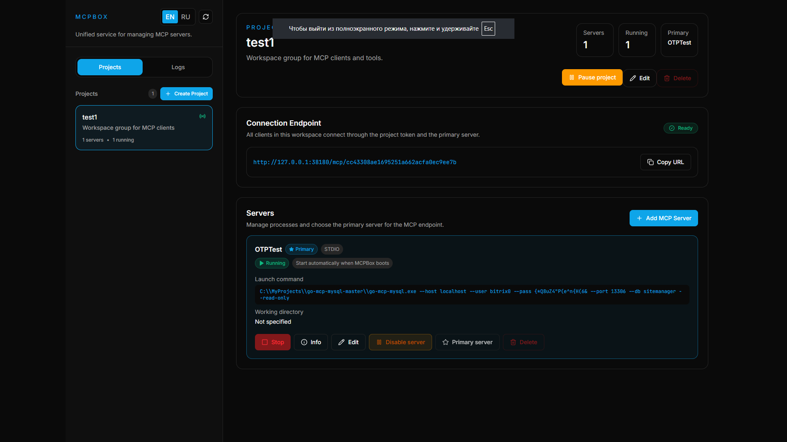

# 📦 MCPBox: Control Center for Your AI Agents

**MCPBox** is a powerful, Go-based gateway and control plane for managing Model Context Protocol (MCP) servers. It provides a central "brain" to connect your databases, local scripts, and APIs to AI clients like Claude, Cursor, and Codex.

## 🚀 Why MCPBox?

As you add more MCP servers, managing them becomes a mess of JSON configs and terminal windows. MCPBox solves this by providing a unified UI to organize, monitor, and secure your AI's access to data.

### Key Features:
- **Project-Based Organization:** Group MCP servers by task, team, or environment.
- **Single Connection URL:** One endpoint per project. Switch backends without reconfiguring your AI client.
- **Safety First:** A "Panic Button" to pause projects or disable specific servers instantly.
- **Visual Inspector:** See exactly what tools, resources, and prompts your local servers are exposing.
- **Audit Logs:** Monitor real-time JSON-RPC traffic. Know exactly what your AI is asking and receiving.
- **Zero Config Start:** A single binary with an embedded web UI. No external database required.

## 🛠 Quick Start

1. **Download & Run:** Grab the latest binary for your OS and run it.
2. **Access UI:** Open `http://localhost:38180` (it usually opens automatically).
3. **Create a Project:** Add a name and description.
4. **Add Servers:** Connect local `stdio` tools (like `npx @modelcontextprotocol/server-postgres`) or remote HTTP endpoints.
5. **Connect Your AI:** Copy the unique Project URL and paste it into your favorite AI tool (Claude, Cursor, etc.). The main MCP entry path is `/mcp/{project_token}`.

## 📖 Documentation
- **[User Guide (RU)](./README-ru.md)** — Russian version of this guide.
- **[Developer Guide](./DEVELOPER.md)** — Technical specs, API documentation, and build instructions.

---
*Built with Go & React for high performance and security.*
